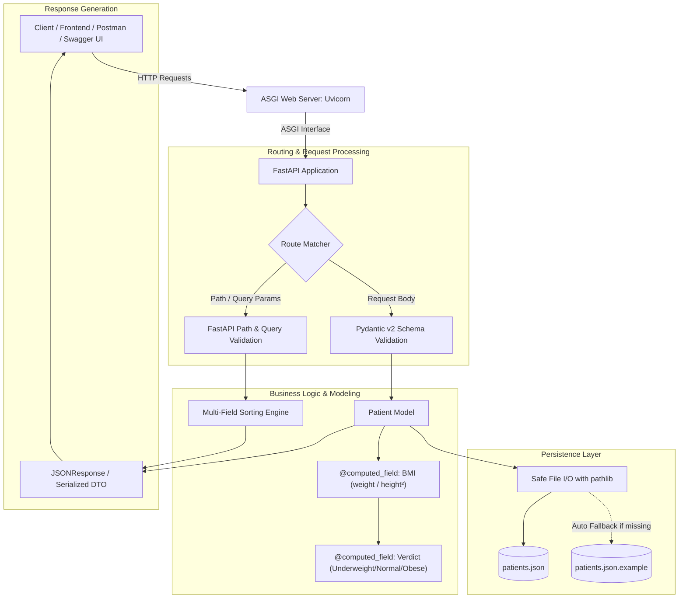

<div align="center">

# 🏥 Patient Management System (FastAPI)

### A Production-Grade RESTful API Demonstrating Advanced FastAPI & Pydantic v2 Patterns

[](https://www.python.org/)
[](https://fastapi.tiangolo.com/)
[](https://docs.pydantic.dev/)
[](https://www.uvicorn.org/)
[](http://127.0.0.1:8000/docs)
[](https://github.com/Arjit005/patient-management-system-fastapi)

<p align="center">
  
</p>

</div>

---

## 📌 Executive Summary

The **Patient Management System** is a modular, high-performance RESTful API built with **FastAPI**, **Pydantic v2**, and **Python 3.13**. It serves as an end-to-end demonstration of modern backend development principles, featuring strong type validation, reactive computed fields (dynamic BMI calculation and medical categorization), comprehensive CRUD endpoints, multi-field sorting, and resilient local data persistence with zero sensitive data exposure.

This project was built to showcase deep, practical understanding of **FastAPI architecture**, **REST standards**, **Pydantic data modeling**, and **production security hygiene**.

---

## 🎯 Architecture & Data Flow



---

## 💡 What This Project Demonstrates to Recruiters

### 1. Modern Python Typing & `typing.Annotated`
Rather than relying on older, loosely-typed paradigms, every path parameter, query parameter, and model field uses Python 3.9+ `typing.Annotated`. This cleanly separates the **type declaration** (`str`, `int`, `float`, `Literal`) from **FastAPI/Pydantic metadata & constraints** (`Field(..., gt=0)`, `Path(...)`, `Query(...)`).

### 2. Advanced Pydantic v2 Patterns
- **Reactive `@computed_field`**: Calculates derived attributes (`bmi` and `verdict`) on serialization without storing redundant data in client payloads.
- **Strict Boundary Constraints**: Prevents invalid medical values using `gt=0`, `lt=120`, and `Literal['male', 'female', 'others']`.
- **Partial Updates with `exclude_unset=True`**: `PatientUpdate` supports partial record editing where only supplied fields are updated, preserving existing attributes.
- **Model Serialization (`model_dump`)**: Clean conversion between Pydantic validation objects and storage dictionaries.

### 3. RESTful API Best Practices & Semantic HTTP Codes
- `POST /create` ➔ Returns **`201 Created`** with structured response.
- `GET /patient/{id}` ➔ Returns **`200 OK`** or triggers **`404 Not Found`** via `HTTPException`.
- `GET /sort` ➔ Dynamic query filtering with **`400 Bad Request`** guardrails on invalid sort fields.
- `PUT /edit/{id}` ➔ Re-validates the merged state and returns **`200 OK`**.
- `DELETE /delete/{id}` ➔ Safely removes records and responds with **`200 OK`**.

### 4. Interactive OpenAPI / Swagger Documentation
Interactive API docs are auto-generated from code annotations and schema descriptions, eliminating manual API documentation overhead.

<div align="center">
  
</div>

### 5. Resilient Storage & Privacy Architecture
- **Zero Sensitive Data Leakage**: `patients.json` is protected via `.gitignore`.
- **Self-Healing Fallback**: `load_data()` detects if the local storage file is absent and automatically initializes from `patients.json.example` without crashing.
- **Path Independence**: Uses `pathlib.Path(__file__).resolve().parent` to ensure the application runs reliably regardless of the working directory.

---

## 🛠️ How I Built This Project: Step-by-Step

### Phase 1: Environment Setup & Modern Dependency Management
1. Initialized the project with modern Python tooling using `uv` and standard `pyproject.toml` configuration.
2. Locked dependencies (`fastapi`, `pydantic`, `uvicorn`) for reproducible builds.
3. Structured clean gitignore rules to exclude IDE files, operating system artifacts, virtual environments, and local databases.

### Phase 2: Domain Modeling with Pydantic v2
Built robust schemas representing the patient entity:

```python
class Patient(BaseModel):
    id: Annotated[str, Field(..., description='ID of Patient', examples=['P001'])]
    name: Annotated[str, Field(..., description='Name of Patient')]
    city: Annotated[str, Field(..., description='Name of city')]
    age: Annotated[int, Field(..., gt=0, lt=120, description='Age of Patient')]
    gender: Annotated[Literal['male', 'female', 'others'], Field(..., description='Gender of Patient')]
    height: Annotated[float, Field(..., gt=0, description='Height of Patient in meters')]
    weight: Annotated[float, Field(..., gt=0, description='Weight of Patient in Kg')]

    @computed_field
    @property
    def bmi(self) -> float:
        return round(self.weight / (self.height ** 2), 2)

    @computed_field
    @property
    def verdict(self) -> str:
        if self.bmi < 18.5:
            return 'Underweight'
        elif self.bmi < 30:
            return 'Normal'
        return 'Obese'
```

### Phase 3: Designing the CRUD & Query Endpoints
- **Create (`POST /create`)**: Validates uniqueness of patient ID, validates types, computes BMI, saves to JSON, and responds with `201 Created`.
- **Read All (`GET /view`)**: Returns the full patient dictionary.
- **Read by ID (`GET /patient/{patient_id}`)**: Validates path parameters with example schemas and handles missing records with `404 Not Found`.
- **Sort & Query (`GET /sort`)**: Implements sorting by query params (`sort_by` in `[height, weight, bmi]`, `order` in `[asc, desc]`).
- **Update (`PUT /edit/{patient_id}`)**: Employs `PatientUpdate` model, extracts non-null patch fields via `model_dump(exclude_unset=True)`, re-instantiates `Patient` to re-run validation and recalculate BMI, and updates state.
- **Delete (`DELETE /delete/{patient_id}`)**: Validates existence and removes the patient record.

### Phase 4: Defensive Error Handling & Data Persistence
- Implemented `load_data()` and `save_data()` with automatic template initialization using `shutil` and `pathlib.Path`.
- Replaced unformatted error details with formatted dynamic error messages.
- Formatted output JSON with indentation for clean debugging.

### Phase 5: Verification & Security Audit
- Verified no personal emails or API credentials exist in version-controlled files.
- Added `patients.json.example` for testing.
- Verified all endpoints and OpenAPI schema generation with zero deprecation warnings.

---

## 🚀 Getting Started

### Prerequisites
- **Python 3.13+**
- **uv** (recommended) or standard **pip**

### Installation

1. **Clone the Repository**
   ```bash
   git clone https://github.com/Arjit005/patient-management-system-fastapi.git
   cd patient-management-system-fastapi
   ```

2. **Set Up Virtual Environment**

   *Using uv:*
   ```bash
   uv sync
   ```

   *Using standard venv:*
   ```bash
   python -m venv .venv
   # Windows:
   .venv\Scripts\activate
   # Linux/macOS:
   source .venv/bin/activate

   pip install fastapi uvicorn pydantic
   ```

3. **Run the Development Server**
   ```bash
   uvicorn main:app --reload
   ```

   Server will start at: `http://127.0.0.1:8000`

---

## 📖 API Documentation & Endpoints

Once the application is running, visit:
- **Swagger UI**: [http://127.0.0.1:8000/docs](http://127.0.0.1:8000/docs)
- **ReDoc**: [http://127.0.0.1:8000/redoc](http://127.0.0.1:8000/redoc)

### Endpoint Summary

| HTTP Method | Endpoint | Description | Status Code | Parameters / Body |
| :--- | :--- | :--- | :--- | :--- |
| `GET` | `/` | Health check and greeting | `200 OK` | None |
| `GET` | `/about` | Information endpoint | `200 OK` | None |
| `GET` | `/view` | Retrieve all patients | `200 OK` | None |
| `GET` | `/patient/{patient_id}` | Retrieve patient by ID | `200 OK` / `404 Not Found` | `patient_id` (Path) |
| `GET` | `/sort` | Sort patients by metric | `200 OK` / `400 Bad Request` | `sort_by`, `order` (Query) |
| `POST` | `/create` | Register new patient | `201 Created` / `400 Bad Request` | `Patient` (Body) |
| `PUT` | `/edit/{patient_id}` | Update existing patient | `200 OK` / `404 Not Found` | `PatientUpdate` (Body) |
| `DELETE` | `/delete/{patient_id}` | Delete a patient | `200 OK` / `404 Not Found` | `patient_id` (Path) |

---

## 🧪 Example API Requests

### 1. Create a Patient (`POST /create`)
```bash
curl -X POST "http://127.0.0.1:8000/create" \
     -H "Content-Type: application/json" \
     -d '{
       "id": "P010",
       "name": "Jane Doe",
       "city": "San Francisco",
       "age": 29,
       "gender": "female",
       "height": 1.70,
       "weight": 62.5
     }'
```
**Response (`201 Created`):**
```json
{
  "message": "Patient data created successfully "
}
```

### 2. View Patient with Computed BMI (`GET /patient/P010`)
```bash
curl -X GET "http://127.0.0.1:8000/patient/P010"
```
**Response (`200 OK`):**
```json
{
  "name": "Jane Doe",
  "city": "San Francisco",
  "age": 29,
  "gender": "female",
  "height": 1.7,
  "weight": 62.5,
  "bmi": 21.63,
  "verdict": "Normal"
}
```

### 3. Sort Patients by BMI descending (`GET /sort`)
```bash
curl -X GET "http://127.0.0.1:8000/sort?sort_by=bmi&order=desc"
```

---

## 🔒 Security Note: Why `patients.json` is Ignored

In this project, the local data file `patients.json` has been intentionally excluded from version control (`.gitignore`) strictly for **security and data privacy reasons**:

- **Protection of Sensitive Healthcare Data**: Patient records contain personal details, physical measurements, and medical health classifications (BMI verdicts). In healthcare applications, exposing such Protected Health Information (PHI) in a public repository violates data privacy standards and security compliance (such as HIPAA).
- **Preventing Accidental Data Leaks**: By ignoring `patients.json`, any real or personal data entered while using or testing the API remains strictly on your local machine and will never be accidentally committed or pushed to GitHub.
- **Separation of Source Code & Database State**: In professional software engineering, Git should track application source code, not live database mutations. Tracking `patients.json` would cause unnecessary Git diffs and merge conflicts whenever patients are added, updated, or deleted.

### How the Project Runs Safely (Template & Auto-Seeding)

To make sure anyone evaluating or testing this repository can run it immediately without missing files or compromising security:

1. A sanitized template file, [`patients.json.example`](./patients.json.example), is included with harmless dummy placeholder data.
2. The backend application in `main.py` is programmed with a self-healing loader:
   ```python
   # Automatically creates local patients.json from the safe template if missing
   if not DATA_FILE.exists():
       if EXAMPLE_DATA_FILE.exists():
           shutil.copy(EXAMPLE_DATA_FILE, DATA_FILE)
       else:
           save_data({})
   ```
*This ensures you get a seamless, out-of-the-box local testing experience while keeping live patient data secure and private.*

---

## 👨‍💻 Author

**Arjit Katiyar**  
- **GitHub**: [@Arjit005](https://github.com/Arjit005)  
- **Repository**: [patient-management-system-fastapi](https://github.com/Arjit005/patient-management-system-fastapi)  
- **LinkedIn**: [Arjit Katiyar](https://www.linkedin.com/in/arjit-katiyar-18758430a)  
- **Specialization**: Backend Development | Python | FastAPI | REST APIs | Distributed Systems
