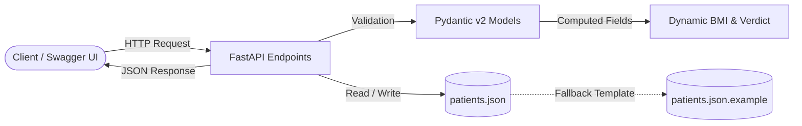
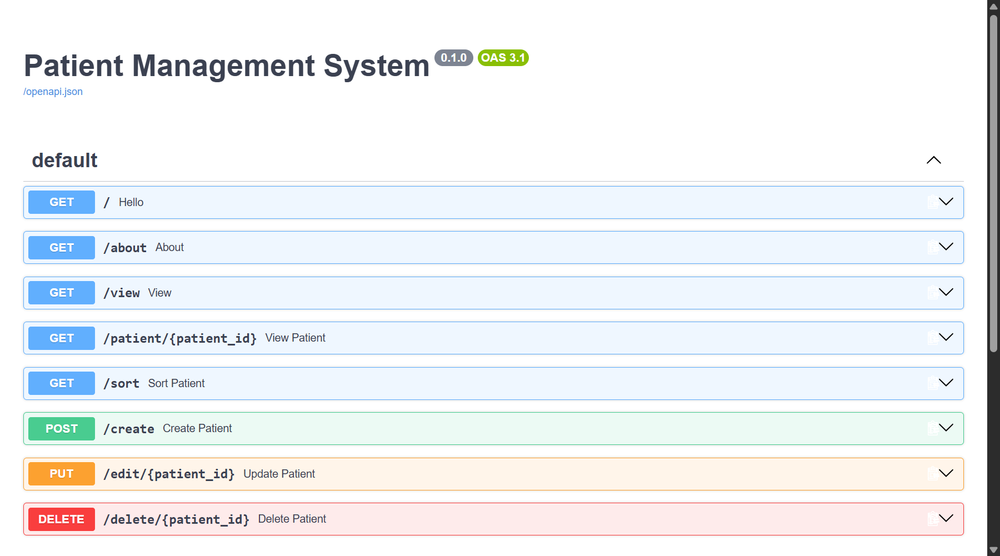
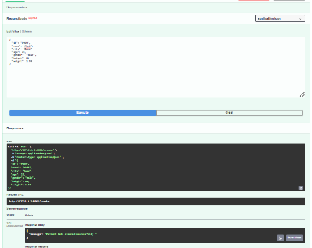
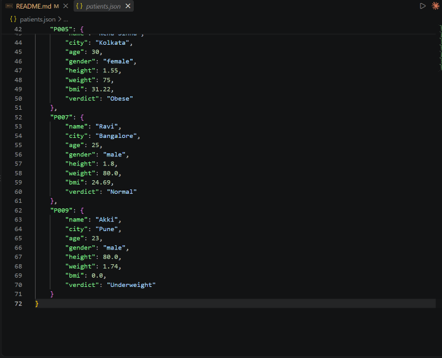

<div align="center">

# 🏥 Patient Management System (FastAPI)

A lightweight RESTful API for managing patient records with automatic BMI calculation, input validation, and JSON storage.

[](https://fastapi.tiangolo.com/)
[](https://www.python.org/)
[](https://docs.pydantic.dev/)
[](http://127.0.0.1:8000/docs)
[](https://github.com/Arjit005/patient-management-system-fastapi)

<p align="center">
  
</p>

</div>

---

## 📌 Overview

A clean backend project built to practice and demonstrate core **FastAPI** and **Pydantic v2** concepts. It provides complete CRUD operations to manage patient records, validates request data automatically, computes real-time BMI and health verdicts, and persists data to a local JSON file.

---

## 🏛️ System Architecture



---

## 📁 Project Structure

```text
patient-management-system-fastapi/
├── .env.example            # Sample environment configuration
├── .gitignore              # Privacy rules (excludes patients.json, .venv)
├── .python-version         # Python version specifier (3.13)
├── main.py                 # FastAPI app, Pydantic models & CRUD endpoints
├── patients.json           # Local runtime data storage (Git-ignored)
├── patients.json.example   # Dummy template for testing & cloning
├── pyproject.toml          # Project dependencies & metadata
└── README.md               # Project documentation
```

---

## ✨ Features

- **Full CRUD Support**: Endpoints to create, read, update, and delete patient records.
- **Computed Fields (Pydantic v2)**: Automatically calculates `bmi` and assigns a health `verdict` (`Underweight`, `Normal`, `Obese`) from height and weight without requiring client input.
- **Strict Data Validation**: Uses `typing.Annotated` and Pydantic constraints (`gt=0`, `lt=120`, `Literal['male', 'female', 'others']`) to reject bad requests.
- **Sorting**: Query endpoint (`/sort`) to order patients by height, weight, or BMI (ascending or descending).
- **Auto-Generated API Docs**: Interactive Swagger UI and ReDoc out-of-the-box.
- **Safe Local Storage**: Uses a JSON file with automatic fallback initialization.

---

## 🚀 Quick Start

### 1. Clone the Repository
```bash
git clone https://github.com/Arjit005/patient-management-system-fastapi.git
cd patient-management-system-fastapi
```

### 2. Install Dependencies
```bash
# Using standard pip:
pip install fastapi uvicorn pydantic

# Or using uv:
uv sync
```

### 3. Run the Server
```bash
uvicorn main:app --reload
```
The API will be live at `http://127.0.0.1:8000`.

---

## 📖 Interactive Documentation & Live Demo

Once the server is running, open:
- **Swagger UI**: [http://127.0.0.1:8000/docs](http://127.0.0.1:8000/docs)
- **ReDoc**: [http://127.0.0.1:8000/redoc](http://127.0.0.1:8000/redoc)

### 1. Endpoints Overview (Swagger UI)
Interactive dashboard displaying all registered endpoints:

<p align="center">
  
</p>

### 2. Live Testing: Create Patient & Data Persistence
Testing `POST /create` in Swagger UI (with `201 Created` response) and verified data persistence with computed `bmi` and `verdict` in `patients.json`:

<p align="center">
  
  
</p>

---

## 🛣️ API Endpoints

| Method | Endpoint | Description |
| :--- | :--- | :--- |
| `GET` | `/` | Root greeting / health check |
| `GET` | `/about` | Project info |
| `GET` | `/view` | Get all patient records |
| `GET` | `/patient/{patient_id}` | Get a single patient by ID |
| `GET` | `/sort` | Sort patients by `height`, `weight`, or `bmi` (`order=asc\|desc`) |
| `POST` | `/create` | Add a new patient (auto-computes BMI & verdict) |
| `PUT` | `/edit/{patient_id}` | Update existing patient details |
| `DELETE` | `/delete/{patient_id}` | Remove a patient record |

---

## 🔒 Security Note: Why `patients.json` is Ignored

The local data file `patients.json` is excluded in `.gitignore` for security and privacy:
- **Medical Data Privacy**: Patient records (names, health metrics, diagnosis) should not be committed to a public GitHub repository.
- **Clean Git History**: Prevents unnecessary git diffs whenever records are created, edited, or deleted during local testing.
- **Zero-Setup Testing**: A safe dummy template [`patients.json.example`](./patients.json.example) is provided. On first run, `main.py` automatically initializes `patients.json` from this template if it doesn't already exist.

---

## 👨‍💻 Author

**Arjit Katiyar**  
- **GitHub**: [@Arjit005](https://github.com/Arjit005)  
- **Repository**: [patient-management-system-fastapi](https://github.com/Arjit005/patient-management-system-fastapi)  
- **Tech**: Python | FastAPI | Pydantic | REST APIs
